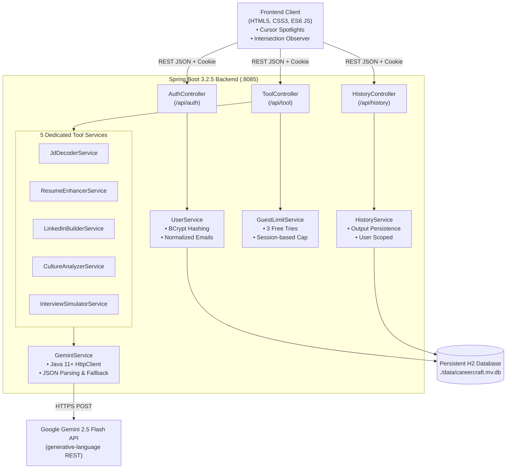

# 🚀 CareerCraft AI — Project Documentation & Presentation Guide

> **Author / Presenter:** Manasvi Sawant  
> **Origin Concept:** Google Cloud Gen AI Academy (APAC Edition)  
> **Course / Lab:** Advanced Java Programming Lab (SPPU)  
> **Tech Stack:** Java 17+, Spring Boot 3.2.5, Spring Data JPA / Hibernate, H2 Database, Google Gemini 2.5 Flash LLM, Modern Vanilla Web UI (HTML5, CSS3, JavaScript ES6)

---

## 📌 Executive Summary (The 30-Second "Elevator Pitch")

### For Anyone:
> *"When looking for a job, people typically juggle 5+ open browser tabs — one to read the job description, another to rewrite resume bullets, another for LinkedIn headline ideas, another to research company values, and another to prep for interviews. **CareerCraft AI** brings all five essential steps into a single unified workspace. Even better, you paste your target job posting once, and all tools automatically synchronize to tailor your resume, headlines, and practice questions to that exact role."*

### For an Academic Evaluator / Teacher:
> *"CareerCraft AI is an enterprise-grade full-stack Java web application built on **Spring Boot 3.2.5** adhering to **RESTful architectural patterns and MVC design principles**. It integrates Google’s **Gemini 2.5 Flash Generative AI model** via custom HTTP-based microservices, backed by a deterministic fallback rule engine. Data is persisted using **Spring Data JPA/Hibernate with an H2 file database**, secured using **BCrypt password hashing and persistent HTTP session state management**."*

---

## 💡 The Problem & Motivation

1. **Tool Fatigue & Context Fragmentation:** Job seekers constantly copy-paste snippets across fragmented tools, losing context between what a job asks for and how their resume/interview matches it.
2. **Generic & Defenseless AI Outputs:** Standard chatbots often invent fake statistics (e.g. *"increased revenue by 85%"*), which hurts candidates during actual interview rounds.
3. **Passive Prep vs. Active Practice:** Most tools just dump question lists without offering an interactive mock interview evaluation loop.

---

## 🛠️ The 5 Core Career Engines

| Tool | Purpose | How It Works & Output Structure |
| :--- | :--- | :--- |
| **1. JD Decoder** | Deconstructs complex Job Descriptions | Segregates **Must-Have** skills from **Nice-to-Have** qualifications and flags hidden corporate **Red Flags** (e.g., *"wear many hats"*, *"fast-paced startup"*). |
| **2. Resume Enhancer** | Transforms weak passive bullet points | Applies the **Google XYZ Formula** (*Accomplished [X] as measured by [Y], by doing [Z]*). Injects honest metric placeholders like `[X%]` so candidates never fake undefendable numbers. |
| **3. LinkedIn Builder** | Optimizes discoverability | Generates recruiter-searchable headlines with high-intent SEO keywords and an engaging profile "About" hook. |
| **4. Culture Analyzer** | Evaluates workplace compatibility | Analyzes company core values and equips candidates with high-impact **Reverse-Interview Questions** to ask the hiring panel. |
| **5. Interview Simulator** | Prepares candidates across interview rounds | Groups questions into **Behavioral (STAR), Technical, and Case-Based** rounds. Includes an interactive in-browser **Practice & Feedback loop** that evaluates candidate answers in real time. |

---

## 🏗️ Technical Architecture & Design



---

## 🔬 Key Engineering Highlights (What to Highlight in Front of a Teacher)

### 1. Robust Dual-Engine Architecture (AI + Deterministic Fallback)
* If the Gemini API is reachable, queries are answered using **Gemini 2.5 Flash** with strict JSON schemas.
* If the API key is missing or network failure occurs, the backend **does not crash**. Every tool implements a deterministic rule-based fallback service (`generateFallback()`) that parses text via regex and syntax heuristics, guaranteeing **100% uptime**.

### 2. Secure Authentication & Session Management
* **Password Hashing:** Passwords are never stored in plaintext. They are encrypted using **BCrypt** with automatic salt generation (`spring-security-crypto`).
* **Session Persistence:** HTTP sessions use `CAREERCRAFT_SESSION` cookies with a 7-day lifespan, `SameSite=lax` protection, and root path assignment.
* **Database Durability:** Uses an embedded H2 file database (`jdbc:h2:file:./data/careercraft;AUTO_SERVER=TRUE`) ensuring user profiles and history persist safely across server restarts.

### 3. Native Java HTTP Client (Avoiding URL-Encoding Pitfalls)
* Google’s API uses custom colon syntax (`gemini-2.5-flash:generateContent`). Traditional HTTP builders often encode colons as `%3A`, causing 404 errors. `GeminiService` utilizes native `java.net.http.HttpClient` with raw URI mapping to guarantee accurate endpoint routing.

### 4. Zero-Framework, High-Performance Frontend
* Built with pure **semantic HTML5, modern CSS variables, and ES6 JavaScript**.
* **Zero bundle overhead** (No React/Webpack overhead).
* **Smooth UI Polish:** Custom cursor spotlights (`--mx`, `--my` mouse-tracking), IntersectionObserver scroll reveals, and instant local state caching for flicker-free page transitions.

---

## 🎤 How to Explain & Present This Project

### 1. The Opening Hook (1 Minute)
> *"Good morning/afternoon. Today I am presenting **CareerCraft AI**, an intelligent career preparation suite designed to streamline job hunting into a unified workflow.*
> 
> *The problem we observed is that job seekers lose significant time jumping across different websites to tailor their materials. CareerCraft AI consolidates this process into five interconnected tools backed by Spring Boot and Google Gemini AI."*

### 2. Live Demo Flow (3–4 Minutes)

1. **The Landing Page (`index.html`):**
   * Show the Hero section and test the **Instant 5-Second Resume Enhancer** preview box right on the landing page.
2. **The Workspace (`try.html`):**
   * Explain the **Active Target Role** banner: *“Notice how I can define my dream job once at the top.”*
   * Run **JD Decoder**: Show how the AI extracts Must-Haves and identifies subtle workplace Red Flags.
   * Switch to **Resume Enhancer**: Show how vague bullets transform into quantifiable XYZ statements.
   * Open **Interview Simulator**: Demonstrate the interactive practice box. Type an answer to a behavioral question and click **Evaluate My Answer** to show real-time STAR method evaluation.
3. **Authentication & Saved History (`history.html`):**
   * Demonstrate logging in.
   * Show that all generated applications are saved to a personal, private history dashboard with search, filter, and re-run capabilities.

### 3. Technical Walkthrough for Teachers (2 Minutes)
* Highlight the backend layers:
  * Controllers handle request validation and guest quotas (`GuestLimitService`).
  * Services coordinate prompt engineering and fallbacks (`GeminiService`).
  * Entities & Repositories (`User`, `HistoryEntry`) leverage JPA for persistent storage.
* Mention the resilience strategy: fallback engines keep the app fully operational even without internet access or API quotas.

---

## ❓ Frequently Asked Questions & Viva Answers

**Q1: Why use Spring Boot instead of Node.js or Python?**
> **Answer:** *“Spring Boot provides enterprise-level structure, robust dependency injection, production-grade security libraries (BCrypt), and strong type safety. It allows clean separation of concerns across Controllers, Services, and Repositories.”*

**Q2: What happens if the Gemini API rate limit is exceeded?**
> **Answer:** *“We designed CareerCraft with fault-tolerance in mind. If an API call fails or times out, the backend automatically catches the exception and routes the query through our local deterministic heuristic engine so the user never sees an error screen.”*

**Q3: How do you prevent users from misusing guest access?**
> **Answer:** *“The `GuestLimitService` tracks usage counts linked to the user’s HTTP session. After 3 requests, the API returns an HTTP 403 status code, prompting the visitor to create a free account.”*

**Q4: How are passwords protected?**
> **Answer:** *“We utilize BCrypt hashing with automatic salts via `BCryptPasswordEncoder`. Even if the database file is inspected directly, the original passwords cannot be reversed or retrieved.”*

---

## 🎯 Oddly Specific Technical Viva Questions (Cheat Sheet)

If your teacher or external examiner points at the screen or opens the IDE asking "oddly specific" code-level questions, here is exactly what to open and what to say:

### 1. "Show me where the actual API call to Google Gemini happens. How are you calling it?"
* **File to open:** `src/main/java/com/careercraft/service/GeminiService.java`
* **What's specific about it:** Uses Java 11’s native `java.net.http.HttpClient` rather than Spring's `RestTemplate` or `WebClient`.
* **What to say:**
  > *"We centralized AI communication in `GeminiService`. We purposefully chose Java's native `HttpClient` instead of `WebClient` because Google’s Gemini endpoint contains a colon in the URL path (`gemini-2.5-flash:generateContent`). Spring's URL builder often encodes the colon as `%3A`, causing a 404. Native `HttpClient` sends the raw URI string cleanly via an HTTPS POST request with JSON payloads."*

### 2. "How do you enforce that the AI responds in JSON rather than random markdown text?"
* **File to open:** `src/main/java/com/careercraft/service/GeminiService.java`
* **What to say:**
  > *"In our request payload to Gemini, we configure `response_mime_type: application/json` inside the generation config. Additionally, our system instructions explicitly instruct the model: 'Respond with strictly valid JSON only. Do not wrap in markdown or backticks.' When the response returns, we clean any stray backticks and parse it into Java domain objects or structured JSON for the frontend."*

### 3. "Show me how the Guest Limit works. How do you prevent someone from spamming 100 requests?"
* **Files to open:** `src/main/java/com/careercraft/service/GuestLimitService.java` and `src/main/java/com/careercraft/controller/ToolController.java`
* **What to say:**
  > *"In `ToolController`, whenever a request hits `/api/tool/run`, we inspect `session.getAttribute(\"userId\")`. If the user is logged in, their usage is unlimited. If they are a guest (`userId == null`), we call `GuestLimitService.canRun(session)`. It increments a counter in the `HttpSession`. If the count exceeds 3, we immediately return an HTTP 403 Forbidden status, which triggers the animated signup prompt on the frontend."*

### 4. "Where is the database located, and how are tables created without SQL scripts?"
* **Files to open:** `src/main/resources/application.properties` and `src/main/java/com/careercraft/model/User.java`
* **What to say:**
  > *"We use an embedded H2 file database located at `./data/careercraft.mv.db`. In `application.properties`, we configured `spring.jpa.hibernate.ddl-auto=update`. When Spring Boot starts, Hibernate automatically inspects our `@Entity` classes (`User.java` and `HistoryEntry.java`) and handles the schema generation and migration automatically."*

### 5. "How are passwords stored? What happens if someone inspects or steals your database file?"
* **File to open:** `src/main/java/com/careercraft/service/UserService.java`
* **What to say:**
  > *"We use `BCryptPasswordEncoder` from `spring-security-crypto`. When a user registers, `passwordEncoder.encode(password)` generates a one-way cryptographic hash with an automatic random salt. When logging in, we verify credentials using `passwordEncoder.matches(raw, hash)`. Even if an attacker copies the `.mv.db` database file, the hashes cannot be reversed back to plain text."*

### 6. "How does the Fallback Rule Engine work if Gemini is offline or unconfigured?"
* **Files to open:** Any of the 5 tool services, e.g., `src/main/java/com/careercraft/service/ResumeEnhancerService.java`
* **What to say:**
  > *"Every single tool service has a `generateFallback()` method. If the Gemini API call throws any exception or if the API key is empty, our code catches it and switches to deterministic rules. For example, in `ResumeEnhancerService`, the fallback parses the sentence, detects passive verbs using regex, and restructures the bullet using the Google XYZ formula with strong action verbs like 'Engineered', 'Optimized', or 'Spearheaded'."*

### 7. "How does the frontend communicate with the backend? Are you using React or Node?"
* **File to open:** `src/main/resources/static/js/api.js`
* **What to say:**
  > *"No, we purposefully built this using vanilla JavaScript (ES6) with the native `fetch` API. This keeps the application lightweight with zero build steps or npm bundle overhead. In `api.js`, every request includes `credentials: 'same-origin'` so the browser automatically sends the session cookie with each request, keeping authentication intact across page navigations."*

### 8. "How does the 'Target Role' feature connect across different tools?"
* **File to open:** `src/main/resources/static/js/demo.js`
* **What to say:**
  > *"When the user enters a target job description in the drawer, we save it into the browser's `sessionStorage` under `careercraft_target_role`. Whenever they click 'Run Tool' on the Resume, LinkedIn, or Interview tools, `demo.js` automatically prepends the target role context to the prompt payload before sending it to the backend, ensuring every output matches that specific job."*

---

## 📁 Project Directory Breakdown

```text
careercraft/
├── src/
│   └── main/
│       ├── java/com/careercraft/
│       │   ├── controller/      # REST API endpoints (Auth, Tool, History)
│       │   ├── model/           # JPA Entities (User, HistoryEntry)
│       │   ├── repository/      # Spring Data JPA interfaces
│       │   ├── service/         # Business Logic, Gemini API, Tool Handlers
│       │   └── CareerCraftApplication.java
│       └── resources/
│           ├── application.properties  # App configurations & DB path
│           └── static/                 # Frontend Web Assets
│               ├── css/         # tokens.css, base.css, components.css, pages.css
│               ├── js/          # api.js, auth.js, demo.js, nav.js, history.js, reveal.js
│               ├── index.html   # Landing page with hero interactive preview
│               ├── try.html     # Application workspace & practice loop
│               ├── history.html # Saved history & search
│               ├── about.html   # Project & creator credentials
│               ├── login.html & signup.html
│               └── how-it-works.html
├── data/                        # Persistent file database storage
├── pom.xml                      # Maven dependencies
└── PROJECT_GUIDE.md             # This comprehensive documentation guide
```
